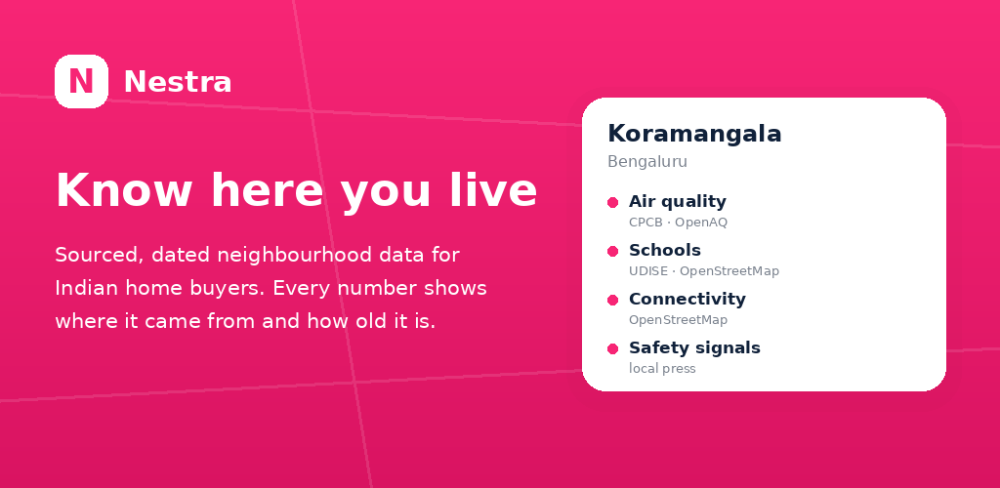
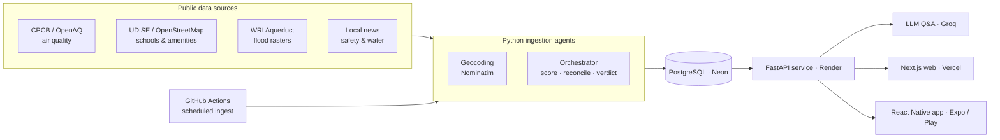

<p align="center">
  
</p>

<h1 align="center">Nestra — Neighbour Trust</h1>

<p align="center">
  <b>Sourced, confidence-tagged neighbourhood data for Indian home buyers.</b><br/>
  Every number shows where it came from, how old it is, and how much to trust it.
</p>

<p align="center">
  <a href="https://neighbour-trust-virid.vercel.app">🌐 Live web app</a> ·
  📱 Android (Google Play — internal testing) ·
  <a href="https://neighbour-trust-virid.vercel.app/about">How the data works</a> ·
  <a href="https://neighbour-trust-virid.vercel.app/privacy">Privacy</a>
</p>

<p align="center">
  
  
  
  
  
  
</p>

---

## What it is

Most property apps are trying to sell you the house. **Nestra isn't.** It pulls
together public information about an area — air quality, schools, flood risk,
connectivity, safety signals — so a buyer or renter can judge a neighbourhood
for themselves. The product's single differentiating principle: **it shows its
work.** No invented "trust scores" presented as fact; every figure on a locality
report names its **source**, its **date**, and its **confidence**, and a card
that has no reliable data says so instead of filling the gap with a guess.

It ships as a **native Android app** (Expo / React Native) and a
**production web app** (Next.js), backed by a **FastAPI** service and a set of
**Python data-ingestion agents**, all in one TypeScript + Python monorepo.

## Highlights

- 📍 **1,671 localities across 6 cities** — Delhi, Noida, Bengaluru, Gurugram, Hyderabad, Mumbai.
- 🌊 **289 flood-prone localities** auto-flagged by sampling WRI Aqueduct flood-hazard rasters at each locality centroid.
- 🧭 **Geospatial pipeline** — OpenStreetMap / Nominatim geocoding, exact-sector matching, and GDAL remote-raster reads.
- 🤖 **LLM-powered Q&A** over each locality's structured data (Groq), plus an automated news classifier for safety/water signals.
- 🌐 **5 languages** — English, Hindi, Kannada, Telugu, Marathi — across both app and web.
- 🔒 **Privacy-first** — no account required, no tracking/ad SDKs, approximate location resolved on-device and never transmitted.
- 🚀 **Shipped end-to-end** — from data pipeline to a Google Play submission, with automated builds (EAS) and scheduled ingestion (GitHub Actions).

## Architecture



A locality report is assembled by the orchestrator, which **scores each category
only where the data supports it, reconciles disagreements between sources
instead of averaging them away, and attaches a confidence level and source/date
to every figure** before the API serves it to both clients.

## Tech stack

| Layer | Technologies |
|---|---|
| **Mobile** | React Native, Expo (SDK 57), Expo Router, TypeScript, EAS Build, i18n |
| **Web** | Next.js (App Router), React, TypeScript, Tailwind CSS |
| **Backend** | Python, FastAPI, Pydantic, REST |
| **Data / agents** | Python, OpenStreetMap / Nominatim, GDAL (geospatial rasters), news classification, Groq LLM |
| **Data store** | PostgreSQL (Neon), PostGIS / H3 spatial keying |
| **Infra / DevOps** | Vercel (web), Render (API), GitHub Actions (CI/CD + scheduled ingest), monorepo |

## Engineering highlights

- **Honesty-first data model.** The report schema carries source, vintage, and
  confidence on every field; the orchestrator refuses to emit a category score
  when the underlying data is too thin, and the UI renders that absence
  explicitly rather than hiding it. Designing *for* missing data was the core
  product constraint.
- **Flood-risk screening from raster models.** A sampler reads a national WRI
  Aqueduct inundation-depth raster, takes the max depth in a window around each
  locality centroid, and bands it into a plain, dated warning — correctly
  flagging real Yamuna-floodplain localities while staying honest that it is
  ~1 km modeled screening, not a street-level survey.
- **Robust geocoding.** Exact-sector-name matching over Nominatim results
  (place/boundary vs. landuse polygons) expanded locality coverage substantially
  without accepting wrong matches.
- **Five-language parity.** A shared key-based i18n layer keeps the app and web
  in sync across English, Hindi, Kannada, Telugu, and Marathi.

## Monorepo layout

```
apps/
  mobile/   Expo / React Native app (Android, Google Play)
  web/      Next.js web app (Vercel)
  api/      FastAPI service (Render)
agents/     Python ingestion + orchestration (air quality, schools, flood, …)
infra/      Postgres migrations, deploy config
docs/       Strategy, build roadmap, architecture decisions
```

## Status

- **Web:** live in production on Vercel.
- **Android:** submitted to Google Play internal testing.
- **Coverage:** 6 cities, 1,671 localities, expanding.

## Design & planning

The product reasoning, six-agent architecture, per-category source/confidence
logic, and UI psychology are written up in [`docs/strategy.md`](docs/strategy.md)
and [`docs/build-roadmap.md`](docs/build-roadmap.md).

---

<p align="center"><i>Know where you live.</i></p>
